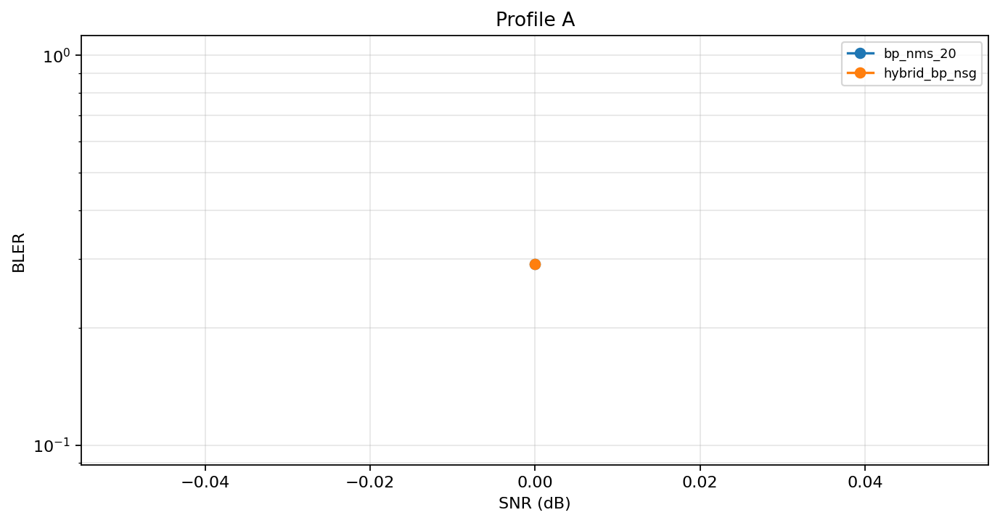
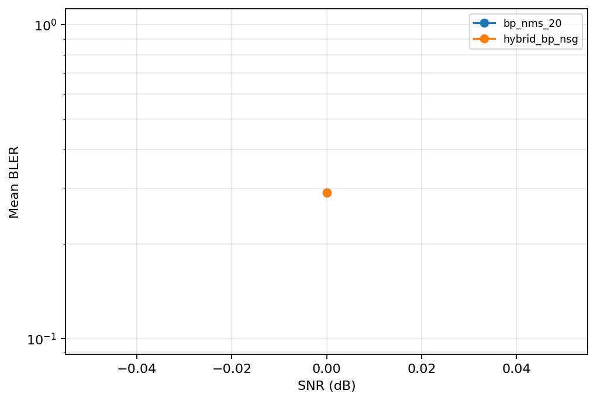
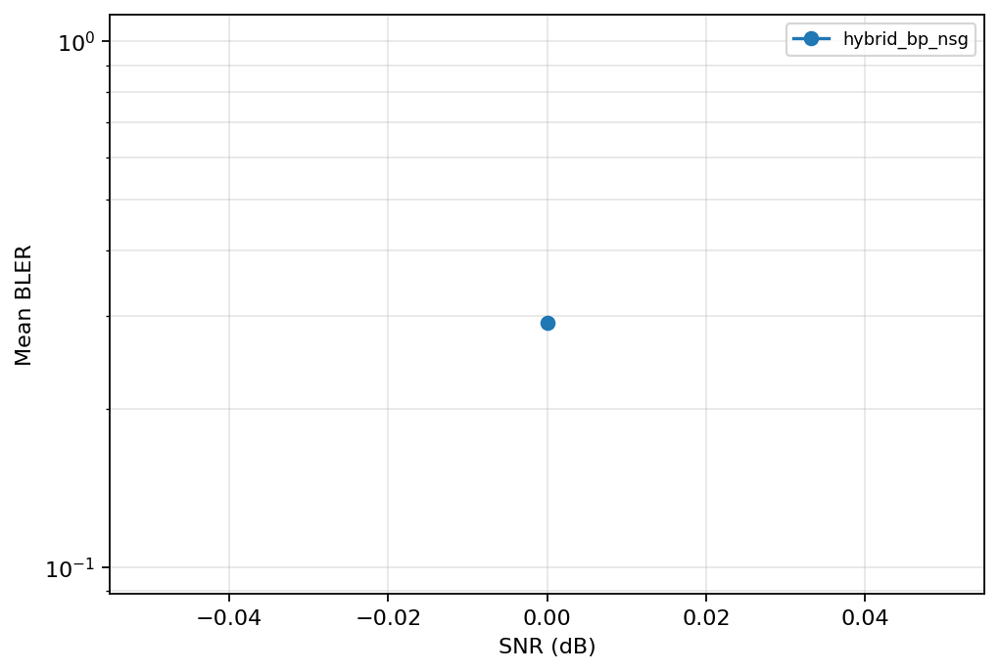
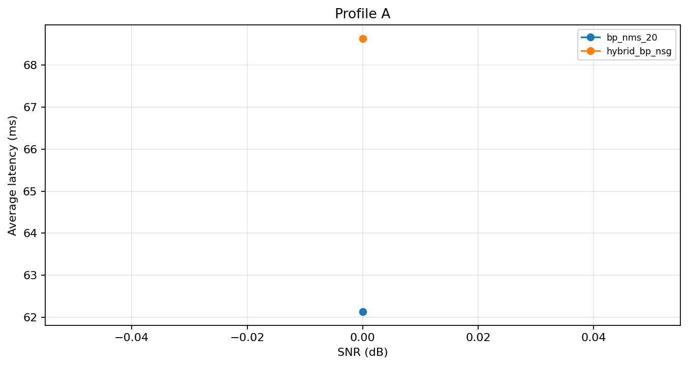
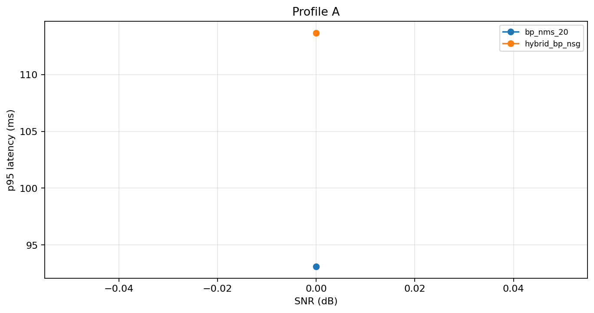
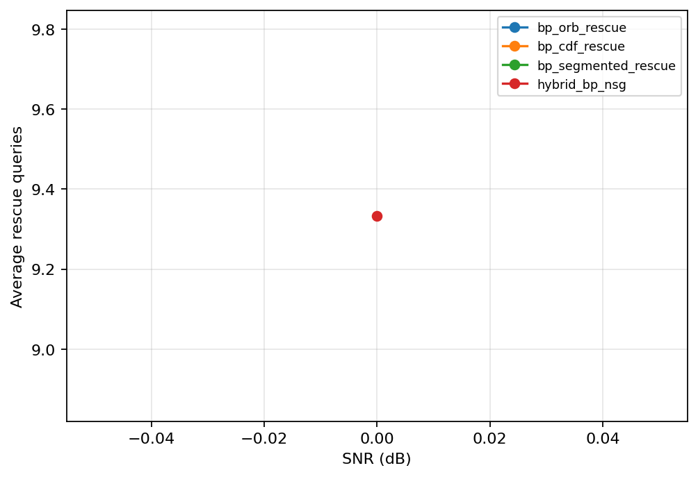
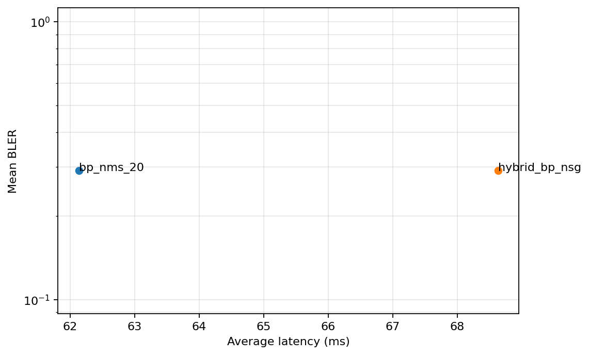
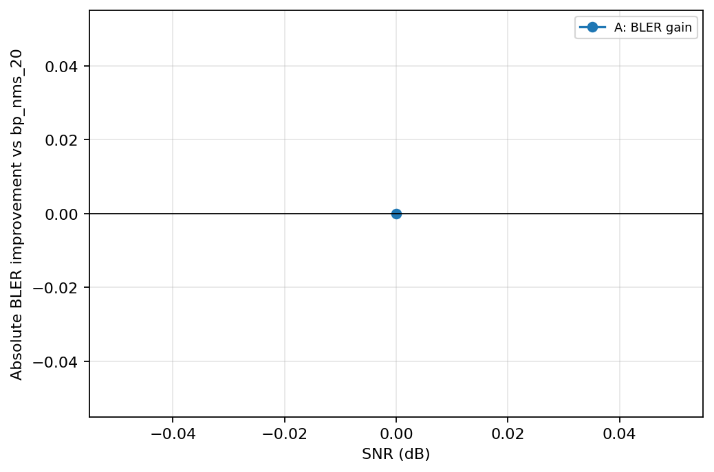
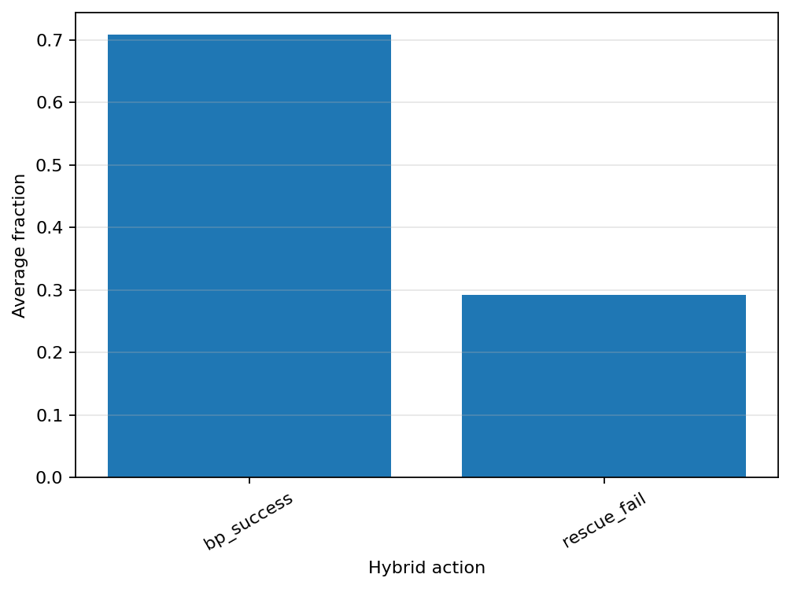
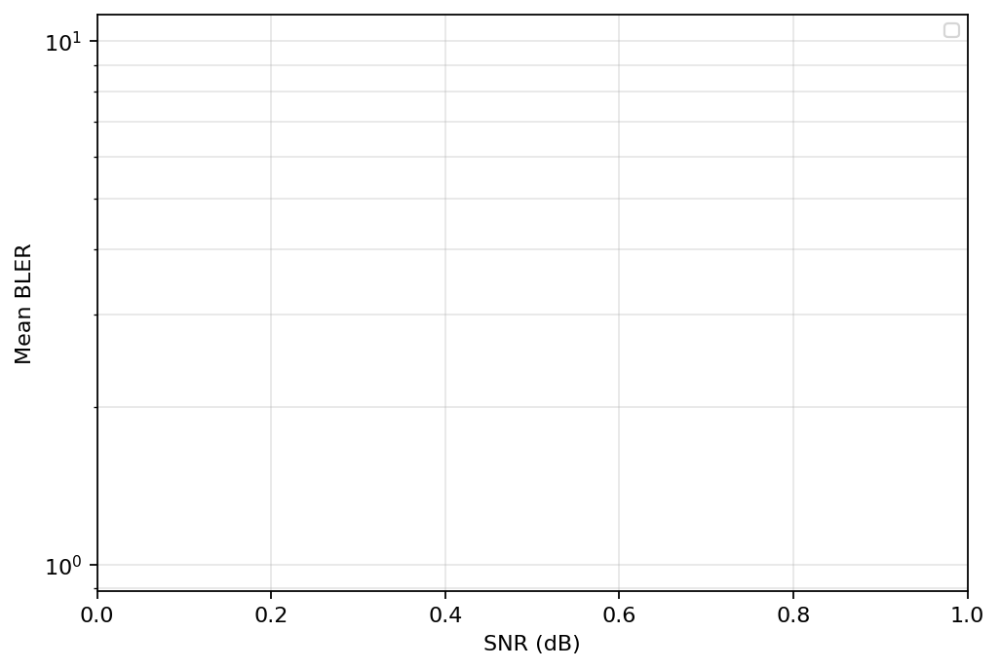

# TWC plots

GitHub does not render a gallery automatically for folders. This README embeds the generated figure PNGs so they are visible directly in the folder view.

Each figure is available as **PNG**, **PDF**, and **CSV**.

## fig01_bler_profiles_log: BLER vs SNR across profiles
[PNG](fig01_bler_profiles_log.png) · [PDF](fig01_bler_profiles_log.pdf) · [CSV](fig01_bler_profiles_log.csv)

## fig02_bler_ldpc_log: BLER of BP-family baselines and hybrid
[PNG](fig02_bler_ldpc_log.png) · [PDF](fig02_bler_ldpc_log.pdf) · [CSV](fig02_bler_ldpc_log.csv)

## fig03_bler_grand_family_log: BLER of rescue-stage GRAND variants
[PNG](fig03_bler_grand_family_log.png) · [PDF](fig03_bler_grand_family_log.pdf) · [CSV](fig03_bler_grand_family_log.csv)

## fig04_avg_latency_profiles: Average latency vs SNR across profiles
[PNG](fig04_avg_latency_profiles.png) · [PDF](fig04_avg_latency_profiles.pdf) · [CSV](fig04_avg_latency_profiles.csv)

## fig05_p95_latency_profiles: p95 latency vs SNR across profiles
[PNG](fig05_p95_latency_profiles.png) · [PDF](fig05_p95_latency_profiles.pdf) · [CSV](fig05_p95_latency_profiles.csv)

## fig06_avg_queries_rescue_family: Average rescue queries across GRAND variants
[PNG](fig06_avg_queries_rescue_family.png) · [PDF](fig06_avg_queries_rescue_family.pdf) · [CSV](fig06_avg_queries_rescue_family.csv)

## fig07_bler_latency_tradeoff: Mean BLER-latency tradeoff
[PNG](fig07_bler_latency_tradeoff.png) · [PDF](fig07_bler_latency_tradeoff.pdf) · [CSV](fig07_bler_latency_tradeoff.csv)

## fig08_hybrid_gain_vs_mainbp: Hybrid BLER gain vs bp_nms_20
[PNG](fig08_hybrid_gain_vs_mainbp.png) · [PDF](fig08_hybrid_gain_vs_mainbp.pdf) · [CSV](fig08_hybrid_gain_vs_mainbp.csv)

## fig09_action_breakdown: Hybrid action breakdown
[PNG](fig09_action_breakdown.png) · [PDF](fig09_action_breakdown.pdf) · [CSV](fig09_action_breakdown.csv)

## fig10_tail_high_snr_log: High-SNR tail BLER
[PNG](fig10_tail_high_snr_log.png) · [PDF](fig10_tail_high_snr_log.pdf) · [CSV](fig10_tail_high_snr_log.csv)

